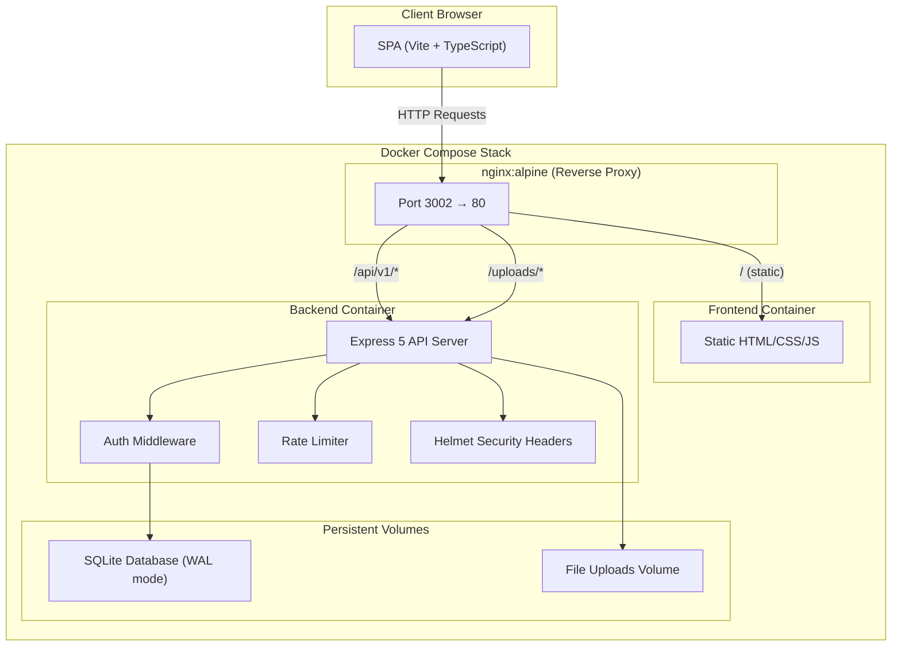

# IT Support Ticketing System — Version 1.0.0 Release Summary

> **Release Date:** July 24, 2026  
> **Git Tag:** `v1.0.0`  
> **Commit:** `7466072cd3fc0ffaf3fa80d1af356a580a3d3bdd`  
> **Repository:** [github.com/cristianjohnn/Ticketing](https://github.com/cristianjohnn/Ticketing)

---

## Architecture Overview

The IT Support Ticketing System is a full-stack, single-page application built as a monorepo with clearly separated frontend and backend layers, containerized for production deployment via Docker Compose with an nginx reverse proxy.

### System Architecture Diagram

### Technology Stack

| Layer | Technology | Version | Purpose |
|-------|-----------|---------|---------|
| **Frontend** | TypeScript | 5.9 | Type-safe application logic |
| **Frontend** | Vite | 6.4 | Build tooling & dev server |
| **Frontend** | Vanilla CSS | — | Styling with CSS custom properties |
| **Backend** | Node.js | 22+ | Runtime environment |
| **Backend** | Express | 5.2 | HTTP framework |
| **Backend** | TypeScript | 5.9 | Type-safe server code |
| **Database** | SQLite (better-sqlite3) | 12.6 | Embedded relational database |
| **Auth** | bcryptjs | 3.0 | Password hashing (10 salt rounds) |
| **Security** | Helmet | 8.0 | HTTP security headers |
| **Security** | express-rate-limit | 7.5 | API rate limiting |
| **File Upload** | Multer | 2.1 | Multipart form handling |
| **Deployment** | Docker Compose | — | Container orchestration |
| **Proxy** | nginx:alpine | — | Reverse proxy & static file serving |

### Deployment Architecture

Production runs as a **3-container Docker Compose stack** on a NAS server:

1. **`ticketing-backend`** — Node.js Express API with health checks, persistent SQLite database and uploads via Docker volumes.
2. **`ticketing-frontend`** — Static files served from an nginx container.
3. **`ticketing-nginx`** — Reverse proxy routing `/api/v1/*` and `/uploads/*` to the backend, everything else to the frontend. Exposes configurable port (default `3002`).

---

## Major Features Implemented

### Ticket Management System
- Full CRUD lifecycle: create, view, update, and delete tickets
- Ticket fields: title, description, department, category, priority, severity, status, assignee
- Threaded notes system with timestamped conversation history
- System-generated audit notes on status/assignee changes
- File attachment uploads with persistent storage
- Ticket rating and feedback upon resolution
- Status workflow: Open → In Progress → Resolved → Closed

### User Account System
- Secure user registration with bcrypt password hashing
- Session-based authentication using cryptographically random UUID tokens
- Role-based access control (Client, IT Support, Admin)
- Admin user management: create, edit, deactivate, and password reset
- Self-service password change with same-password rejection and policy enforcement
- Concurrent session invalidation on password change
- Automatic session expiration (30-day TTL)

### Knowledge Base
- Article CRUD with category and author metadata
- Drag-and-drop article reordering
- Accessible to all authenticated users

### Admin Dashboard
- Real-time statistics: total tickets, open count, in-progress count, resolved count
- SLA compliance tracking
- Recent activity feed
- Ticket distribution overview

### UI/UX
- Dual-theme design: Dark Mode (default) and Light Mode
- Animated hexagonal grid background with smooth theme-aware transitions
- Glassmorphism card design language
- Responsive sidebar navigation with per-role views
- Toast notification system
- Smooth CSS theme transitions with Material Design cubic-bezier easing

---

## Security Features

| Feature | Implementation |
|---------|---------------|
| **Password Hashing** | bcryptjs with 10 salt rounds |
| **Session Tokens** | `crypto.randomUUID()` — cryptographically secure |
| **Session Expiry** | 30-day TTL with server-side validation |
| **HTTP Headers** | Helmet middleware (HSTS, X-Frame-Options, etc.) |
| **Rate Limiting** | 150 req/15min (general API), 10 req/1min (login) |
| **SQL Injection** | All queries use prepared statements (better-sqlite3) |
| **RBAC** | Middleware-enforced role checks on every protected route |
| **Password Policy** | Minimum 8 characters, at least 1 letter + 1 number |
| **Same-Password Rejection** | Backend validates new ≠ current via bcrypt comparison |
| **Session Invalidation** | All concurrent sessions revoked on password change |
| **Account Deactivation** | Deactivated users immediately blocked from login and session validation |
| **CORS** | Configured via `cors` middleware |
| **Foreign Keys** | SQLite `PRAGMA foreign_keys = ON` with cascade deletes |

---

## Testing Performed

### Phase 5: End-to-End Regression Testing

A comprehensive programmatic E2E test suite was executed covering:

1. **User Registration Flow** — Verified client sign-up, bcrypt hashing, and duplicate username/email rejection.
2. **Authentication & Session Management** — Validated login, token generation, session restoration, and logout.
3. **Multi-Device Concurrent Sessions** — Confirmed concurrent token issuance and selective invalidation on password change.
4. **Ticket CRUD Authorization** — Verified clients only access their own tickets; admins access all tickets.
5. **Self-Service Password Change** — Tested same-password rejection, weak-password rejection, and successful change with session invalidation.
6. **Admin Operations** — Verified ticket status updates, assignee changes, system note generation, and user deactivation.
7. **Deactivated User Enforcement** — Confirmed deactivated accounts are blocked from both login and session validation.
8. **Build Verification** — Clean `tsc` compilation and `vite build` with zero errors across all phases.

**Result: All tests passed with zero regressions.**

---

## Known Limitations

Version 1.0 intentionally prioritizes a stable, secure, and maintainable single-server architecture over advanced enterprise features:

| Limitation | Impact |
|-----------|--------|
| **No email notifications** | Users must manually check for ticket updates |
| **No self-service password recovery** | Admin must manually reset forgotten passwords |
| **No real-time updates** | Dashboard and ticket lists require manual refresh |
| **SQLite single-server** | Not horizontally scalable; suitable for small-to-medium teams |
| **No file upload validation** | No file type whitelist or size limit enforcement |
| **No admin account management audit log** | Administrative account actions (user creation, role changes, password resets, deactivation) are not recorded in a dedicated persistent audit log. Ticket operations do generate system notes. |

---

## Future Improvements (Version 1.1+)

- **Email notifications for ticket events** — Notify users on ticket creation, assignment, status changes, and resolution
- **Self-service password recovery via email** — Secure token-based password reset flow without admin intervention
- **Real-time updates (WebSocket or SSE)** — Live ticket feeds, dashboard counters, and notification badges
- **SLA escalation automation** — Automatic priority escalation and reassignment when SLA deadlines approach
- **Dashboard analytics and reporting enhancements** — Charts, trend analysis, and exportable reports
- **LDAP / SSO integration** — Enterprise directory authentication for streamlined user provisioning
- **External database support** — PostgreSQL or Supabase for horizontal scalability and production resilience
- **REST API versioning enhancements** — Structured API evolution strategy
- **Automated backup and restore** — Scheduled SQLite database snapshots with one-click recovery
- **Advanced search and filtering** — Full-text search across tickets, notes, and knowledge base articles
- **Role-based permissions refinement** — Granular permission matrix beyond the current 3-role model
- **Mobile-responsive optimizations** — Touch-friendly layouts and PWA support for field technicians

---

## Final Project Statistics

| Metric | Count |
|--------|-------|
| **Frontend Pages** | 7 (Login, Dashboard, Tickets, Create Ticket, Knowledge Base, Users, Profile) |
| **API Endpoints** | 27 (across 5 route modules + health + root) |
| **Database Tables** | 6 (tickets, users, sessions, notes, articles, attachments) |
| **User Roles** | 3 (Client, IT Support, Admin) |
| **Total Commits** | 20 (from `git log --oneline v1.0.0`) |
| **Files Changed** | 69 (from `git diff --shortstat` against initial commit) |
| **Lines of Code** | 10,837 insertions (from `git diff --shortstat` against initial commit) |
| **Git Tag** | `v1.0.0` |
| **Commit Hash** | `7466072cd3fc0ffaf3fa80d1af356a580a3d3bdd` |

### Route Breakdown

| Module | Endpoints | Auth Required |
|--------|-----------|--------------|
| **Auth** (`/api/v1/auth`) | 4 (login, register, validate, logout) | Login only has rate limiter |
| **Tickets** (`/api/v1/tickets`) | 7 (CRUD + notes + attachments) | Yes (all routes) |
| **Articles** (`/api/v1/articles`) | 6 (CRUD + reorder) | No |
| **Users** (`/api/v1/users`) | 7 (CRUD + deactivate + reset-password + change-password) | Yes (admin-only except self-service) |
| **Stats** (`/api/v1/stats`) | 1 (dashboard stats) | No |
| **System** | 2 (root redirect + health check) | No |
